# todly 데이터베이스 설계 (PostgreSQL)

| 항목 | 내용 |
|---|---|
| DBMS | PostgreSQL 16 |
| 명명 규칙 | 테이블 `snake_case` 복수형, PK `id`(UUID v7), 시각 `*_at`(timestamptz, UTC) |
| 공통 컬럼 | `created_at`, `updated_at`, 일부 `deleted_at`(소프트 삭제) |
| 식별자 | `UUID` (시간정렬형 v7 권장) — 분산/노출 안전 |
| 문자셋 | UTF-8 |

---

## 1. ERD (Mermaid)

```mermaid
erDiagram
    users ||--o{ oauth_accounts : has
    users ||--o{ refresh_tokens : owns
    users ||--o{ group_members : joins
    groups ||--o{ group_members : contains
    groups ||--o{ sections : has
    groups ||--o{ tasks : has
    groups ||--o{ routines : has
    groups ||--o{ invitations : issues
    sections ||--o{ tasks : groups
    tasks ||--o{ task_assignees : assigned
    users ||--o{ task_assignees : assignee
    tasks ||--o{ subtasks : has
    tasks ||--o{ comments : has
    tasks ||--o{ activities : logs
    tasks ||--o{ live_sessions : tracked_by
    users ||--o{ live_sessions : performs
    routines ||--o{ tasks : generates
    users ||--o{ activities : actor
    groups ||--o{ activities : scope
    users ||--o{ notifications : receives
    users ||--o{ comments : writes
    users ||--o{ device_tokens : registers
    users ||--o{ friendships : requests
    users ||--|| user_stats : has
    users ||--o{ daily_activity : logs
    tasks ||--o{ live_rooms : hosts
    routines ||--o{ live_rooms : hosts
    live_rooms ||--o{ live_room_participants : has
    live_rooms ||--o{ live_room_messages : has
    live_rooms ||--o{ photos : shares
    tasks ||--o{ photos : attaches
    routines ||--o{ routine_logs : tracks
    routines ||--|| routine_streaks : has

    friendships {
        uuid id PK
        uuid requester_id FK
        uuid addressee_id FK
        enum status
    }
    live_rooms {
        uuid id PK
        uuid task_id FK
        uuid host_id FK
        enum status
        timestamptz started_at
    }
    live_room_messages {
        uuid id PK
        uuid room_id FK
        uuid sender_id FK
        string body
        string emoji
    }
    photos {
        uuid id PK
        uuid task_id FK
        uuid room_id FK
        text url
    }
    user_stats {
        uuid user_id PK
        int life_score
        int routine_score
        int current_streak
        int best_streak
    }

    users {
        uuid id PK
        string email UK
        string password_hash
        string nickname
        enum profile_color
        string avatar_url
        timestamptz created_at
    }
    groups {
        uuid id PK
        string name
        string color
        uuid owner_id FK
        timestamptz created_at
    }
    group_members {
        uuid id PK
        uuid group_id FK
        uuid user_id FK
        enum role
        timestamptz last_seen_at
    }
    sections {
        uuid id PK
        uuid group_id FK
        string title
        int position
    }
    tasks {
        uuid id PK
        uuid group_id FK
        uuid section_id FK
        uuid routine_id FK
        string title
        enum status
        enum priority
        date due_date
        timestamptz completed_at
    }
    task_assignees {
        uuid task_id FK
        uuid user_id FK
    }
    subtasks {
        uuid id PK
        uuid task_id FK
        string title
        bool is_done
    }
    live_sessions {
        uuid id PK
        uuid task_id FK
        uuid user_id FK
        timestamptz started_at
        timestamptz ended_at
    }
    routines {
        uuid id PK
        uuid group_id FK
        string title
        enum recur_freq
        jsonb recur_rule
        bool is_active
    }
    activities {
        uuid id PK
        uuid group_id FK
        uuid actor_id FK
        enum type
        uuid target_task_id FK
        jsonb meta
        timestamptz created_at
    }
    comments {
        uuid id PK
        uuid task_id FK
        uuid author_id FK
        text body
    }
    notifications {
        uuid id PK
        uuid user_id FK
        enum type
        bool is_read
    }
    invitations {
        uuid id PK
        uuid group_id FK
        string code UK
        enum status
    }
    device_tokens {
        uuid id PK
        uuid user_id FK
        string token UK
        enum platform
    }
```



---

## 2. ENUM 타입

```sql
CREATE TYPE profile_color   AS ENUM ('blue','green','orange','purple');
CREATE TYPE member_role     AS ENUM ('owner','admin','member');
CREATE TYPE task_status     AS ENUM ('todo','in_progress','done','archived');
CREATE TYPE task_priority   AS ENUM ('none','low','medium','high','urgent');
CREATE TYPE recur_freq      AS ENUM ('daily','weekly','monthly','custom');
CREATE TYPE activity_type   AS ENUM (
  'task_created','task_completed','task_reopened',
  'live_started','live_ended','member_joined','comment_added','routine_done',
  'milestone_reached','friend_joined_room','photo_shared'   -- v2.0
);
CREATE TYPE invitation_status AS ENUM ('pending','accepted','expired','revoked');
CREATE TYPE notification_type AS ENUM (
  'due_soon','overdue','assigned','live_started','milestone','mention','invite',
  'comment','friend_request','friend_accepted','room_cheer'  -- v2.0
);
CREATE TYPE device_platform AS ENUM ('web','ios','android');
CREATE TYPE oauth_provider  AS ENUM ('apple','google');

-- v2.0 추가 (실제 디자인 반영)
CREATE TYPE group_type        AS ENUM ('group','couple','travel','list'); -- 그룹/커플/여행/리스트
CREATE TYPE app_theme         AS ENUM ('ocean','mint','violet','coral','sunset'); -- 5테마
CREATE TYPE friendship_status AS ENUM ('pending','accepted','blocked');
CREATE TYPE room_status       AS ENUM ('live','ended');
CREATE TYPE live_status       AS ENUM ('running','paused','done'); -- 라이브 시작/일시정지/완료
```

> `task_status`는 디자인의 ✅완료 / 🔵진행중(라이브) / ⬜미완료에 대응(`done`/`in_progress`/`todo`).

---

## 3. 테이블 정의 (DDL)

### 3.1 users — 사용자
```sql
CREATE TABLE users (
    id            UUID PRIMARY KEY DEFAULT gen_random_uuid(),
    email         VARCHAR(255) NOT NULL UNIQUE,
    username      VARCHAR(30)  NOT NULL UNIQUE,  -- v2.0 @아이디(@seokhyun)
    password_hash VARCHAR(255),                 -- 소셜 전용 계정은 NULL 허용
    nickname      VARCHAR(20)  NOT NULL,         -- 표시 이름("김석현"/"석현")
    profile_color profile_color NOT NULL DEFAULT 'blue',
    avatar_url    TEXT,
    theme         app_theme NOT NULL DEFAULT 'ocean',  -- v2.0 테마 색상
    dark_mode     BOOLEAN  NOT NULL DEFAULT false,     -- v2.0 다크모드
    language      VARCHAR(8) NOT NULL DEFAULT 'ko',
    timezone      VARCHAR(64)  NOT NULL DEFAULT 'Asia/Seoul',
    last_active_at TIMESTAMPTZ,
    created_at    TIMESTAMPTZ NOT NULL DEFAULT now(),
    updated_at    TIMESTAMPTZ NOT NULL DEFAULT now(),
    deleted_at    TIMESTAMPTZ
);
CREATE INDEX idx_users_email ON users(email) WHERE deleted_at IS NULL;
CREATE INDEX idx_users_username ON users(username) WHERE deleted_at IS NULL;
```
| 컬럼 | 설명 |
|---|---|
| username | **v2.0** 고유 @아이디(친구 검색·초대 키) |
| nickname | 표시 이름("김석현"), 아바타 이니셜 원천 |
| profile_color | 멤버 식별 색상(디자인 4색) |
| theme / dark_mode | **v2.0** 5테마(오션/민트/바이올렛/코랄/선셋) + 다크모드 |
| password_hash | BCrypt; 소셜 전용 계정은 NULL |

### 3.2 oauth_accounts — 소셜 로그인 연결
```sql
CREATE TABLE oauth_accounts (
    id            UUID PRIMARY KEY DEFAULT gen_random_uuid(),
    user_id       UUID NOT NULL REFERENCES users(id) ON DELETE CASCADE,
    provider      oauth_provider NOT NULL,
    provider_uid  VARCHAR(255) NOT NULL,
    created_at    TIMESTAMPTZ NOT NULL DEFAULT now(),
    UNIQUE (provider, provider_uid)
);
```

### 3.3 refresh_tokens — 세션/토큰
```sql
CREATE TABLE refresh_tokens (
    id          UUID PRIMARY KEY DEFAULT gen_random_uuid(),
    user_id     UUID NOT NULL REFERENCES users(id) ON DELETE CASCADE,
    token_hash  VARCHAR(255) NOT NULL,
    expires_at  TIMESTAMPTZ NOT NULL,
    revoked_at  TIMESTAMPTZ,
    created_at  TIMESTAMPTZ NOT NULL DEFAULT now()
);
CREATE INDEX idx_refresh_user ON refresh_tokens(user_id);
```

### 3.4 groups — 그룹(공동 목표)
```sql
CREATE TABLE groups (
    id          UUID PRIMARY KEY DEFAULT gen_random_uuid(),
    name        VARCHAR(60) NOT NULL,           -- "이사 준비", "여행 · 제주"
    type        group_type NOT NULL DEFAULT 'group', -- v2.0 그룹/커플/여행/리스트
    color       VARCHAR(20) NOT NULL DEFAULT 'blue',
    icon        VARCHAR(40),
    description TEXT,
    owner_id    UUID NOT NULL REFERENCES users(id),
    created_at  TIMESTAMPTZ NOT NULL DEFAULT now(),
    updated_at  TIMESTAMPTZ NOT NULL DEFAULT now(),
    deleted_at  TIMESTAMPTZ
);
```

### 3.5 group_members — 그룹 멤버십
```sql
CREATE TABLE group_members (
    id           UUID PRIMARY KEY DEFAULT gen_random_uuid(),
    group_id     UUID NOT NULL REFERENCES groups(id) ON DELETE CASCADE,
    user_id      UUID NOT NULL REFERENCES users(id) ON DELETE CASCADE,
    role         member_role NOT NULL DEFAULT 'member',
    last_seen_at TIMESTAMPTZ,                    -- "N명 접속" 계산용
    joined_at    TIMESTAMPTZ NOT NULL DEFAULT now(),
    UNIQUE (group_id, user_id)
);
CREATE INDEX idx_gm_group ON group_members(group_id);
CREATE INDEX idx_gm_user  ON group_members(user_id);
```
> "멤버 4명 · 3명 접속"은 `count(*)` 와 `last_seen_at > now()-interval '2 min'` 또는 실시간 presence(Redis)로 산출.

### 3.6 sections — 섹션(투두 카테고리)
```sql
CREATE TABLE sections (
    id         UUID PRIMARY KEY DEFAULT gen_random_uuid(),
    group_id   UUID NOT NULL REFERENCES groups(id) ON DELETE CASCADE,
    title      VARCHAR(60) NOT NULL,             -- "짐 싸기"
    position   INT NOT NULL DEFAULT 0,           -- 정렬 순서
    created_at TIMESTAMPTZ NOT NULL DEFAULT now()
);
CREATE INDEX idx_sections_group ON sections(group_id, position);
```

### 3.7 tasks — 투두(핵심)
```sql
CREATE TABLE tasks (
    id           UUID PRIMARY KEY DEFAULT gen_random_uuid(),
    group_id     UUID REFERENCES groups(id) ON DELETE CASCADE, -- NULL이면 개인 투두
    section_id   UUID REFERENCES sections(id) ON DELETE SET NULL,
    routine_id   UUID REFERENCES routines(id) ON DELETE SET NULL, -- 루틴 생성분
    creator_id   UUID NOT NULL REFERENCES users(id),
    title        VARCHAR(200) NOT NULL,          -- "주방 정리하기"
    note         TEXT,
    status       task_status NOT NULL DEFAULT 'todo',
    priority     task_priority NOT NULL DEFAULT 'none',
    due_date     DATE,                           -- "오늘 마감"
    due_at       TIMESTAMPTZ,                    -- 시간까지 필요 시
    position     INT NOT NULL DEFAULT 0,
    completed_at TIMESTAMPTZ,
    completed_by UUID REFERENCES users(id),
    version      INT NOT NULL DEFAULT 0,         -- 낙관적 락(동시편집)
    created_at   TIMESTAMPTZ NOT NULL DEFAULT now(),
    updated_at   TIMESTAMPTZ NOT NULL DEFAULT now(),
    deleted_at   TIMESTAMPTZ
);
CREATE INDEX idx_tasks_group   ON tasks(group_id) WHERE deleted_at IS NULL;
CREATE INDEX idx_tasks_section ON tasks(section_id);
CREATE INDEX idx_tasks_due     ON tasks(due_date) WHERE status <> 'done';
CREATE INDEX idx_tasks_status  ON tasks(group_id, status);
```
| 컬럼 | 디자인 매핑 |
|---|---|
| status | ✅done / 🔵in_progress / ⬜todo |
| due_date | "오늘 마감", "1일 지남" 계산 기준 |
| section_id | "짐 싸기" 그룹화 |
| version | 동시 편집 충돌 방지 |

### 3.8 task_assignees — 담당자(N:M)
```sql
CREATE TABLE task_assignees (
    task_id    UUID NOT NULL REFERENCES tasks(id) ON DELETE CASCADE,
    user_id    UUID NOT NULL REFERENCES users(id) ON DELETE CASCADE,
    assigned_at TIMESTAMPTZ NOT NULL DEFAULT now(),
    PRIMARY KEY (task_id, user_id)
);
```

### 3.9 subtasks — 하위 체크리스트
```sql
CREATE TABLE subtasks (
    id        UUID PRIMARY KEY DEFAULT gen_random_uuid(),
    task_id   UUID NOT NULL REFERENCES tasks(id) ON DELETE CASCADE,
    title     VARCHAR(200) NOT NULL,
    is_done   BOOLEAN NOT NULL DEFAULT false,
    position  INT NOT NULL DEFAULT 0
);
CREATE INDEX idx_subtasks_task ON subtasks(task_id);
```

### 3.10 live_sessions — 실시간 "라이브/진행중"
```sql
CREATE TABLE live_sessions (
    id         UUID PRIMARY KEY DEFAULT gen_random_uuid(),
    task_id    UUID NOT NULL REFERENCES tasks(id) ON DELETE CASCADE,
    user_id    UUID NOT NULL REFERENCES users(id) ON DELETE CASCADE,
    status     live_status NOT NULL DEFAULT 'running', -- v2.0 running/paused/done
    started_at TIMESTAMPTZ NOT NULL DEFAULT now(),
    paused_seconds INT NOT NULL DEFAULT 0,        -- v2.0 일시정지 누적(경과 보정)
    ended_at   TIMESTAMPTZ,                      -- NULL이면 진행 중
    created_at TIMESTAMPTZ NOT NULL DEFAULT now()
);
-- 사용자당 동시에 1개의 활성 세션만 (부분 유니크 인덱스)
CREATE UNIQUE INDEX uq_live_active_user
  ON live_sessions(user_id) WHERE ended_at IS NULL;
CREATE INDEX idx_live_active_task ON live_sessions(task_id) WHERE ended_at IS NULL;
```
> 홈 "지금 활동 중", 그룹 "라이브 · N분"의 원천. 경과시간 = `now() - started_at`.
> 실시간 카운트/접속표시는 Redis presence와 병행, 영속 기록은 이 테이블에.

### 3.11 routines — 반복 할 일
```sql
CREATE TABLE routines (
    id          UUID PRIMARY KEY DEFAULT gen_random_uuid(),
    group_id    UUID REFERENCES groups(id) ON DELETE CASCADE,
    creator_id  UUID NOT NULL REFERENCES users(id),
    title       VARCHAR(200) NOT NULL,
    section_id  UUID REFERENCES sections(id) ON DELETE SET NULL,
    recur_freq  recur_freq NOT NULL,
    recur_rule  JSONB,            -- {byweekday:[1,3], interval:1} / RRULE 호환
    next_run_at TIMESTAMPTZ,      -- 다음 생성 시각(스케줄러 기준)
    is_active   BOOLEAN NOT NULL DEFAULT true,
    created_at  TIMESTAMPTZ NOT NULL DEFAULT now()
);
CREATE INDEX idx_routines_next ON routines(next_run_at) WHERE is_active;
```

### 3.12 activities — 활동 피드/로그
```sql
CREATE TABLE activities (
    id            UUID PRIMARY KEY DEFAULT gen_random_uuid(),
    group_id      UUID REFERENCES groups(id) ON DELETE CASCADE,
    actor_id      UUID NOT NULL REFERENCES users(id),
    type          activity_type NOT NULL,
    target_task_id UUID REFERENCES tasks(id) ON DELETE SET NULL,
    meta          JSONB,          -- {title:"택배 포장하기", ...}
    created_at    TIMESTAMPTZ NOT NULL DEFAULT now()
);
CREATE INDEX idx_activities_group_time ON activities(group_id, created_at DESC);
```
> 활동 탭 피드 + "OO님이 'XX' 완료" 알림 원천. 양이 큰 테이블 → 월 파티셔닝/TTL 고려.

### 3.13 comments — 투두 댓글
```sql
CREATE TABLE comments (
    id         UUID PRIMARY KEY DEFAULT gen_random_uuid(),
    task_id    UUID NOT NULL REFERENCES tasks(id) ON DELETE CASCADE,
    author_id  UUID NOT NULL REFERENCES users(id),
    body       TEXT NOT NULL,
    created_at TIMESTAMPTZ NOT NULL DEFAULT now(),
    deleted_at TIMESTAMPTZ
);
CREATE INDEX idx_comments_task ON comments(task_id, created_at);
```

### 3.14 notifications — 알림
```sql
CREATE TABLE notifications (
    id         UUID PRIMARY KEY DEFAULT gen_random_uuid(),
    user_id    UUID NOT NULL REFERENCES users(id) ON DELETE CASCADE,
    type       notification_type NOT NULL,
    title      VARCHAR(120) NOT NULL,
    body       TEXT,
    link       TEXT,             -- 딥링크(투두/그룹)
    is_read    BOOLEAN NOT NULL DEFAULT false,
    created_at TIMESTAMPTZ NOT NULL DEFAULT now()
);
CREATE INDEX idx_notif_user_unread ON notifications(user_id, is_read, created_at DESC);
```

### 3.15 invitations — 그룹 초대
```sql
CREATE TABLE invitations (
    id          UUID PRIMARY KEY DEFAULT gen_random_uuid(),
    group_id    UUID NOT NULL REFERENCES groups(id) ON DELETE CASCADE,
    inviter_id  UUID NOT NULL REFERENCES users(id),
    code        VARCHAR(16) NOT NULL UNIQUE,     -- 초대 코드/링크
    email       VARCHAR(255),                    -- 이메일 초대(선택)
    status      invitation_status NOT NULL DEFAULT 'pending',
    expires_at  TIMESTAMPTZ,
    created_at  TIMESTAMPTZ NOT NULL DEFAULT now()
);
```

### 3.16 device_tokens — 푸시 토큰
```sql
CREATE TABLE device_tokens (
    id         UUID PRIMARY KEY DEFAULT gen_random_uuid(),
    user_id    UUID NOT NULL REFERENCES users(id) ON DELETE CASCADE,
    token      VARCHAR(512) NOT NULL UNIQUE,
    platform   device_platform NOT NULL,
    created_at TIMESTAMPTZ NOT NULL DEFAULT now()
);
```

### 3.17 notification_settings — 알림 환경설정
```sql
CREATE TABLE notification_settings (
    user_id        UUID PRIMARY KEY REFERENCES users(id) ON DELETE CASCADE,
    push_due       BOOLEAN NOT NULL DEFAULT true,
    push_assigned  BOOLEAN NOT NULL DEFAULT true,
    push_live      BOOLEAN NOT NULL DEFAULT true,
    push_comment   BOOLEAN NOT NULL DEFAULT true,
    quiet_from     TIME,
    quiet_to       TIME
);
```

---

## 3-B. v2.0 신규 테이블 (실제 디자인 반영)

### 3.18 friendships — 친구 관계/요청
```sql
CREATE TABLE friendships (
    id          UUID PRIMARY KEY DEFAULT gen_random_uuid(),
    requester_id UUID NOT NULL REFERENCES users(id) ON DELETE CASCADE,
    addressee_id UUID NOT NULL REFERENCES users(id) ON DELETE CASCADE,
    status      friendship_status NOT NULL DEFAULT 'pending', -- pending/accepted/blocked
    created_at  TIMESTAMPTZ NOT NULL DEFAULT now(),
    responded_at TIMESTAMPTZ,
    CONSTRAINT no_self_friend CHECK (requester_id <> addressee_id),
    UNIQUE (requester_id, addressee_id)
);
CREATE INDEX idx_friend_addressee ON friendships(addressee_id, status); -- 받은 요청
CREATE INDEX idx_friend_requester ON friendships(requester_id, status);
```
> 친구 관리(요청 수락/거절), 친구 검색(@아이디), "함께한 그룹 N개"는 friendships + group_members 조인으로 산출. 온라인 상태는 users.last_active_at / Redis presence.

### 3.19 live_rooms — 라이브 룸 (다인원 실시간 방)
```sql
CREATE TABLE live_rooms (
    id          UUID PRIMARY KEY DEFAULT gen_random_uuid(),
    task_id     UUID REFERENCES tasks(id) ON DELETE SET NULL,
    routine_id  UUID REFERENCES routines(id) ON DELETE SET NULL,
    host_id     UUID NOT NULL REFERENCES users(id),
    title       VARCHAR(120) NOT NULL,           -- "아침 러닝"
    status      room_status NOT NULL DEFAULT 'live',
    started_at  TIMESTAMPTZ NOT NULL DEFAULT now(),
    ended_at    TIMESTAMPTZ
);
CREATE INDEX idx_rooms_status ON live_rooms(status) WHERE status='live';
```

### 3.20 live_room_participants — 룸 참여자
```sql
CREATE TABLE live_room_participants (
    room_id   UUID NOT NULL REFERENCES live_rooms(id) ON DELETE CASCADE,
    user_id   UUID NOT NULL REFERENCES users(id) ON DELETE CASCADE,
    is_host   BOOLEAN NOT NULL DEFAULT false,
    joined_at TIMESTAMPTZ NOT NULL DEFAULT now(),
    left_at   TIMESTAMPTZ,
    PRIMARY KEY (room_id, user_id)
);
```
> "3명이 함께 달리는 중 · 12분" = 활성 참여자 수 + room.started_at 경과.

### 3.21 live_room_messages — 응원 메시지/이모지
```sql
CREATE TABLE live_room_messages (
    id        UUID PRIMARY KEY DEFAULT gen_random_uuid(),
    room_id   UUID NOT NULL REFERENCES live_rooms(id) ON DELETE CASCADE,
    sender_id UUID NOT NULL REFERENCES users(id) ON DELETE CASCADE,
    body      VARCHAR(300),                       -- "마지막 바퀴 가자! 🏃"
    emoji     VARCHAR(16),                        -- 단독 이모지 응원(🔥💪🎉)
    created_at TIMESTAMPTZ NOT NULL DEFAULT now()
);
CREATE INDEX idx_room_msg ON live_room_messages(room_id, created_at);
```

### 3.22 photos — 사진(투두 첨부 + 라이브 룸 공유 통합)
```sql
CREATE TABLE photos (
    id         UUID PRIMARY KEY DEFAULT gen_random_uuid(),
    uploader_id UUID NOT NULL REFERENCES users(id) ON DELETE CASCADE,
    task_id    UUID REFERENCES tasks(id) ON DELETE CASCADE,      -- 투두 첨부
    room_id    UUID REFERENCES live_rooms(id) ON DELETE CASCADE, -- 룸 공유
    url        TEXT NOT NULL,
    thumb_url  TEXT,
    width      INT, height INT, bytes INT,
    created_at TIMESTAMPTZ NOT NULL DEFAULT now(),
    CHECK (task_id IS NOT NULL OR room_id IS NOT NULL)
);
CREATE INDEX idx_photos_task ON photos(task_id);
CREATE INDEX idx_photos_room ON photos(room_id, created_at);
```

### 3.23 user_stats — 게이미피케이션 집계
```sql
CREATE TABLE user_stats (
    user_id          UUID PRIMARY KEY REFERENCES users(id) ON DELETE CASCADE,
    life_score       INT NOT NULL DEFAULT 0,   -- 라이프 점수
    routine_score    INT NOT NULL DEFAULT 0,   -- 루틴 점수
    completion_rate  NUMERIC(5,2) NOT NULL DEFAULT 0, -- 완료율(%)
    current_streak   INT NOT NULL DEFAULT 0,   -- 연속 일수
    best_streak      INT NOT NULL DEFAULT 0,   -- 최고 연속(32일)
    yearly_count     INT NOT NULL DEFAULT 0,   -- 올해 완료(248회)
    updated_at       TIMESTAMPTZ NOT NULL DEFAULT now()
);
```

### 3.24 daily_activity — 잔디 heatmap 일자별 집계
```sql
CREATE TABLE daily_activity (
    user_id   UUID NOT NULL REFERENCES users(id) ON DELETE CASCADE,
    day       DATE NOT NULL,
    count     INT NOT NULL DEFAULT 0,            -- 그날 완료 수(잔디 강도)
    PRIMARY KEY (user_id, day)
);
CREATE INDEX idx_daily_user ON daily_activity(user_id, day);
```
> 프로필 "최근 16주" / 꾸준함 "올해 248회"는 이 테이블 집계. 루틴별 잔디는 daily 집계에 routine_id 차원을 더하거나 routine_logs로 분리.

### 3.25 routine_logs / routine_streaks — 루틴 회차·연속
```sql
CREATE TABLE routine_logs (
    id         UUID PRIMARY KEY DEFAULT gen_random_uuid(),
    routine_id UUID NOT NULL REFERENCES routines(id) ON DELETE CASCADE,
    user_id    UUID NOT NULL REFERENCES users(id) ON DELETE CASCADE,
    done_on    DATE NOT NULL,
    skipped    BOOLEAN NOT NULL DEFAULT false,
    UNIQUE (routine_id, user_id, done_on)
);
CREATE TABLE routine_streaks (
    routine_id UUID PRIMARY KEY REFERENCES routines(id) ON DELETE CASCADE,
    current_streak INT NOT NULL DEFAULT 0,  -- "32일", "21일"
    best_streak    INT NOT NULL DEFAULT 0,
    updated_at TIMESTAMPTZ NOT NULL DEFAULT now()
);
```
> 루틴 카드 "12일째", 꾸준함 화면 "매일 6:30 · 32일"의 원천.

### 3.26 task_consistency (뷰/집계) — 투두별 꾸준함 "14주째"
투두 상세의 "이 투두의 꾸준함 14주째"는 (반복 투두/루틴 연결) routine_logs를 주 단위로 집계하거나 `task_consistency_weeks` 캐시 컬럼으로 보관.

---

## 4. 핵심 파생 쿼리

### 4.1 그룹 전체 진행률 ("80% 완료")
```sql
SELECT
  count(*) FILTER (WHERE status = 'done')::float
  / NULLIF(count(*), 0) * 100 AS progress_pct
FROM tasks
WHERE group_id = :groupId AND deleted_at IS NULL;
```

### 4.2 "확인이 필요해요" (오늘 마감 + 지연)
```sql
SELECT t.*, g.name AS group_name
FROM tasks t JOIN groups g ON g.id = t.group_id
JOIN task_assignees a ON a.task_id = t.id
WHERE a.user_id = :userId
  AND t.status <> 'done'
  AND t.due_date <= CURRENT_DATE
ORDER BY t.due_date ASC, t.priority DESC;
```

### 4.3 "지금 활동 중" (실시간 라이브)
```sql
SELECT u.nickname, u.profile_color, t.title, ls.started_at,
       now() - ls.started_at AS elapsed
FROM live_sessions ls
JOIN users u ON u.id = ls.user_id
JOIN tasks t ON t.id = ls.task_id
WHERE ls.ended_at IS NULL
  AND t.group_id IN (SELECT group_id FROM group_members WHERE user_id = :userId)
ORDER BY ls.started_at DESC;
```

### 4.4 멤버 접속 수 ("4명 · 3명 접속")
```sql
SELECT
  count(*) AS total,
  count(*) FILTER (WHERE last_seen_at > now() - interval '2 minutes') AS online
FROM group_members WHERE group_id = :groupId;
```

---

## 5. 인덱스 / 성능 전략
- 조회 핫패스: `tasks(group_id, status)`, `tasks(due_date) WHERE status<>'done'`, `activities(group_id, created_at DESC)`.
- 부분 인덱스로 활성 라이브 세션·미완료 투두만 인덱싱 → 크기 최소화.
- `activities`는 시간 기반 파티셔닝(월) + 오래된 파티션 아카이브.
- 진행률은 빈번 조회 → 필요 시 `group_progress` 머티리얼라이즈드 뷰 또는 캐시(Redis).

## 6. 무결성 / 정합성 규칙
- 트리거 또는 애플리케이션 레벨로 `updated_at` 자동 갱신.
- 투두 완료 시 `completed_at`/`completed_by` 세팅, 재오픈 시 NULL.
- 라이브 시작 시 동일 사용자 기존 활성 세션 자동 종료(부분 유니크로 강제).
- Owner 탈퇴 전 위임 강제(애플리케이션 검증).
- 소프트 삭제(`deleted_at`) 대상은 조회에서 기본 제외.

## 7. 보안 / 개인정보
- `password_hash`는 BCrypt(cost ≥ 10). 평문 저장 금지.
- 토큰은 해시 저장(`token_hash`), 원문 비저장.
- 탈퇴 시: 개인정보 컬럼 익명화 + 관련 활동은 actor 표기 "탈퇴한 사용자".
- 행 수준 접근통제: 모든 조회는 `group_members` 소속 검증을 거친다(애플리케이션/RLS 옵션).
