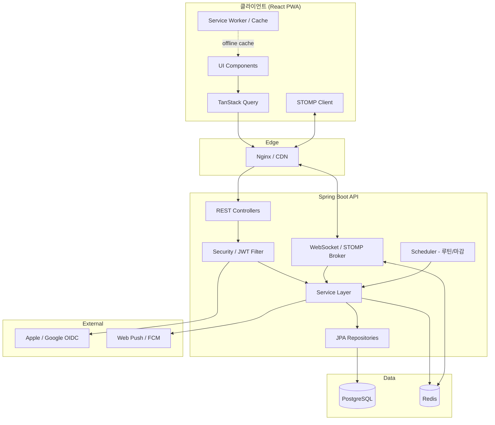

# todly 기술 설계서 (Technical Design)

| 레이어 | 기술 |
|---|---|
| 프론트엔드 | **React 18 + TypeScript + Vite**, PWA, 모바일 우선 |
| 상태/데이터 | TanStack Query(서버상태) + Zustand(클라이언트상태) |
| 스타일 | Tailwind CSS + 디자인 토큰, Radix UI(접근성 프리미티브) |
| 실시간 | STOMP over WebSocket (SockJS fallback) |
| 백엔드 | **Spring Boot 3.x (Java 21)**, Spring Web, Spring Security, Spring Data JPA, Spring WebSocket |
| 인증 | JWT(Access/Refresh) + OAuth2/OIDC(Apple/Google) |
| DB | PostgreSQL 16, Flyway 마이그레이션 |
| 캐시/Presence | Redis (presence, 진행률 캐시, pub/sub) |
| 인프라 | Docker, Nginx(정적+리버스프록시), 컨테이너 오케스트레이션 |

---

## 1. 시스템 아키텍처



설계 원칙: **API 우선·무상태 백엔드**(수평 확장), 실시간은 STOMP+Redis pub/sub로 멀티 인스턴스 브로드캐스트, 읽기 핫패스는 Redis 캐시.

---

## 2. 프론트엔드 설계 (React PWA)

### 2.1 스택 상세
- 빌드: Vite (빠른 HMR, 코드 스플리팅)
- 라우팅: React Router v6 (탭별 라우트 + 보호 라우트)
- 서버 상태: TanStack Query (캐시·낙관적 업데이트·재요청)
- 클라이언트 상태: Zustand (인증·UI·presence 로컬)
- 폼: React Hook Form + Zod (검증 스키마 공유)
- 스타일: Tailwind + CSS 변수 토큰, 다크모드 `class` 전략
- 실시간: `@stomp/stompjs` + `sockjs-client`
- PWA: `vite-plugin-pwa`(Workbox) — manifest, 오프라인 셸, 푸시

### 2.2 폴더 구조
```
src/
├─ app/                # 앱 셸, 라우터, 프로바이더
│   ├─ router.tsx
│   └─ providers.tsx
├─ pages/              # 화면 단위
│   ├─ auth/ (Login, Signup, ResetPassword)
│   ├─ home/ (Dashboard)
│   ├─ groups/ (GroupList, GroupDetail, GroupCreate)
│   ├─ activity/
│   ├─ routines/
│   └─ profile/
├─ features/           # 도메인 기능(슬라이스)
│   ├─ auth/  (api, hooks, store)
│   ├─ tasks/ (api, hooks, components: TaskItem, TaskEditor, TaskDetail, Comments, PhotoUploader)
│   ├─ groups/
│   ├─ live/  (presence hook, useLiveSessions)
│   ├─ rooms/ (LiveRoom, CheerComposer, room photos) — v2.0
│   ├─ friends/ (FriendList, FriendRequest, user search) — v2.0
│   ├─ routines/ (routine list, streak)
│   ├─ gamification/ (Heatmap, ScoreCard, stats) — v2.0
│   ├─ settings/ (ThemePicker, dark mode, account, help) — v2.0
│   └─ notifications/
├─ shared/
│   ├─ ui/             # Button, Avatar, ProgressBar, BottomNav, FAB...
│   ├─ lib/            # api client(axios), stomp client, queryClient
│   ├─ tokens/         # design tokens (color, spacing, radius)
│   └─ hooks/
├─ entities/           # 타입(User, Group, Task...) - 백엔드 DTO 미러
└─ main.tsx
```

### 2.3 디자인 토큰 (`Tudly.dc.html`에서 **실측 추출** — v2.0 교정)
> v1.0 추정값은 실제와 달라 전면 교정했습니다. 아래는 HTML/CSS에서 직접 추출한 값입니다.
```css
:root{
  /* Primary (Ocean 기본 테마) */
  --color-primary: #2E86E6;       /* 메인 브랜드 블루(최다 사용) */
  --color-primary-strong: #1366CE;/* 진한 블루 = 하단 네비 활성/CTA 강조 */
  --color-primary-deep: #1257C4;  /* 더 진한 음영 */
  --color-primary-soft: #7DB4ED;  /* 보조 블루 */
  --color-primary-tint: #C8E0FA;  /* 연블루 틴트 */
  /* 텍스트/뉴트럴 */
  --color-text: #14233A;          /* 딥 네이비 본문 */
  --color-text-muted: #5A6B82;
  --color-text-subtle: #9AA7BC;
  --color-nav-inactive: #AEB9CC;  /* 하단 네비 비활성 */
  /* 배경 */
  --color-bg: #EDF1F7;            /* 연한 블루그레이 배경 */
  --color-bg-2: #F2F6FC;
  --color-card: #FFFFFF;
  /* 상태색 (실측) */
  --color-due:    #FF7A6B;        /* 오늘 마감(코랄) */
  --color-overdue:#FFB23E;        /* 지남(앰버) */
  --color-success:#46D38A;        /* 완료(그린) */
  /* 프로필 4색 (실측) */
  --avatar-blue:#2E86E6; --avatar-mint:#2BC4B0;
  --avatar-orange:#FF9D52; --avatar-purple:#6B5BD0;
  /* 라운드 (실측) */
  --radius-phone: 28px;           /* 폰 프레임 */
  --radius-card: 18px;            /* 카드 18~24px */
  --radius-card-lg: 22px;
  --radius-chip: 14px; --radius-pill: 999px;
  --space-1:4px; --space-2:8px; --space-3:12px; --space-4:16px;
  /* 폰트 */
  --font: "Pretendard","Pretendard Variable",-apple-system,sans-serif;
  --font-display: "Sora", sans-serif;  /* 로고/디스플레이 */
}
```

### 2.3.1 테마 색상 (5종, `data-theme`로 전환) — v2.0
> 설정·테마 색상 화면의 오션/민트/바이올렛/코랄/선셋. `--color-primary` 계열을 테마별로 치환.
```css
[data-theme="ocean"]  { --color-primary:#2E86E6; --color-primary-strong:#1366CE; }
[data-theme="mint"]   { --color-primary:#2BC4B0; --color-primary-strong:#159B89; }
[data-theme="violet"] { --color-primary:#6B5BD0; --color-primary-strong:#5346A8; }
[data-theme="coral"]  { --color-primary:#FF7A6B; --color-primary-strong:#E0584A; }
[data-theme="sunset"] { --color-primary:#FF9D52; --color-primary-strong:#E07B2E; }
/* 다크모드는 [data-dark="true"] 로 배경/텍스트 토큰 치환 */
```
> 정확한 보조/음영값은 구현 시 `Tudly.dc.html`에서 테마별로 재확인하세요.

### 2.4 핵심 컴포넌트
| 컴포넌트 | 설명 |
|---|---|
| `<BottomNav>` | 홈/그룹/활동/루틴/프로필 5탭 |
| `<Avatar color initial img>` | 멤버 식별 아바타 |
| `<ProgressBar value>` | 그룹/섹션 진행률 |
| `<TaskItem>` | 체크박스·제목·메타·라이브뱃지 |
| `<LiveBadge startedAt>` | 경과시간 실시간 카운트 |
| `<PresenceCard>` | 홈 "지금 활동 중" 카드 |
| `<AttentionCard>` | "확인이 필요해요" 항목 |
| `<FAB>` | 투두/그룹 생성 |
| `<ImInButton>` | "내가 할게요" 빠른 담당+라이브 (v2.0) |
| `<LiveRoom>` | 라이브 룸(참여자·사진·응원) (v2.0) |
| `<CheerComposer>` | 응원 메시지/이모지 입력 (v2.0) |
| `<Heatmap>` | 잔디(16주/루틴별) (v2.0) |
| `<ScoreCard>` | 라이프/루틴 점수·연속일수 (v2.0) |
| `<ThemePicker>` | 5테마·다크모드 (v2.0) |
| `<FriendList>` / `<FriendRequest>` | 친구 목록·요청 (v2.0) |
| `<PhotoUploader>` | 투두/룸 사진 첨부 (v2.0) |

### 2.5 낙관적 업데이트 예시 (투두 완료)
```ts
const toggleDone = useMutation({
  mutationFn: (id:string)=> api.patch(`/tasks/${id}/complete`),
  onMutate: async (id) => {
    await qc.cancelQueries({queryKey:['tasks',groupId]});
    const prev = qc.getQueryData(['tasks',groupId]);
    qc.setQueryData(['tasks',groupId], (old)=> markDone(old,id)); // 즉시 반영
    return { prev };
  },
  onError:(_e,_id,ctx)=> qc.setQueryData(['tasks',groupId], ctx.prev), // 롤백
  onSettled:()=> qc.invalidateQueries({queryKey:['tasks',groupId]}),
});
```

### 2.6 실시간 클라이언트
- 로그인 후 STOMP 연결, 토큰을 CONNECT 헤더로 전달.
- 구독: `/topic/groups/{groupId}` (투두/진행률/라이브), `/user/queue/notifications`.
- 수신 이벤트로 TanStack Query 캐시를 갱신(setQueryData) → 화면 자동 반영.
- 라이브 시작/종료, 멤버 presence는 heartbeat로 `last_seen_at` 갱신.

---

## 3. 백엔드 설계 (Spring Boot)

### 3.1 레이어드 아키텍처
```
Controller → Service → Repository → DB
        ↘ DTO/Mapper ↘ Domain(Entity)
```
- Controller: REST/WS 엔드포인트, 검증, DTO 변환
- Service: 트랜잭션 경계, 도메인 규칙, 이벤트 발행
- Repository: Spring Data JPA(+ 필요한 곳 QueryDSL)
- Domain: JPA 엔티티(불변 규칙 캡슐화)

### 3.2 패키지 구조
```
com.todly
├─ config/        (Security, WebSocket, Redis, Cors, OpenAPI)
├─ auth/          (Controller, Service, JwtProvider, OAuthClient)
├─ user/          (User, @username, theme/darkMode, ProfileService)
├─ group/         (Group, GroupMember, Invitation)
├─ friend/        (Friendship, request/accept/block, user search) — v2.0
├─ task/          (Task, Section, Subtask, Assignee)
├─ comment/       (Comment) — v2.0
├─ photo/         (Photo, ObjectStorage, signed URL) — v2.0
├─ live/          (LiveSession, PresenceService)
├─ room/          (LiveRoom, Participant, Message, RoomService) — v2.0
├─ routine/       (Routine, RoutineScheduler, RoutineStreak)
├─ gamification/  (UserStats, DailyActivity, ScoreService) — v2.0
├─ activity/      (Activity feed)
├─ notification/  (Notification, PushSender, DeviceToken)
└─ common/        (BaseEntity, ApiResponse, ExceptionHandler)
```

### 3.3 인증/인가
- **JWT**: Access(15분) + Refresh(14일, 회전·해시 저장). `OncePerRequestFilter`로 검증.
- **소셜**: Apple/Google ID 토큰 검증(OIDC) → 이메일로 가입/연결 → 자체 JWT 발급.
- **인가**: 메서드 보안(`@PreAuthorize`) + 그룹 멤버십 검사(AOP/서비스). Owner/Admin 권한 분기.
- 비밀번호: `BCryptPasswordEncoder`.

### 3.4 실시간 (STOMP)
- `@EnableWebSocketMessageBroker`, 엔드포인트 `/ws`(SockJS).
- 심플 브로커 → 확장 시 외부 브로커(Redis/RabbitMQ relay).
- 인증: STOMP CONNECT 인터셉터에서 JWT 검증 → Principal 주입.
- 발행: 서비스에서 도메인 이벤트 → `SimpMessagingTemplate.convertAndSend("/topic/groups/{id}", payload)`.
- 멀티 인스턴스: Redis pub/sub로 인스턴스 간 팬아웃.

### 3.5 스케줄러
- 루틴 생성: `next_run_at <= now()` 루틴을 주기 배치로 투두 인스턴스화 후 다음 실행 계산.
- 마감 알림: 매시간 마감 임박/지연 스캔 → 알림 생성·푸시.
- (다중 인스턴스 안전: ShedLock 등 분산 락)

---

## 4. REST API 명세 (핵심)

> 공통: `Authorization: Bearer <accessToken>`, JSON, 표준 에러 `{code,message,details}`.

### 4.1 인증
| Method | Path | 설명 |
|---|---|---|
| POST | `/api/v1/auth/signup` | 회원가입(닉네임,이메일,비번,프로필색) |
| POST | `/api/v1/auth/login` | 이메일 로그인 → access/refresh |
| POST | `/api/v1/auth/oauth/{provider}` | Apple/Google 토큰 로그인 |
| POST | `/api/v1/auth/refresh` | 토큰 재발급 |
| POST | `/api/v1/auth/logout` | refresh 폐기 |
| POST | `/api/v1/auth/password/reset-request` | 재설정 메일 |
| POST | `/api/v1/auth/password/reset` | 비번 변경 |

### 4.2 사용자/프로필
| Method | Path | 설명 |
|---|---|---|
| GET | `/api/v1/me` | 내 정보 |
| PATCH | `/api/v1/me` | 닉네임/색상/아바타 수정 |
| GET | `/api/v1/me/notifications` | 알림 목록 |
| PATCH | `/api/v1/me/notification-settings` | 알림 설정 |

### 4.3 홈 대시보드
| Method | Path | 설명 |
|---|---|---|
| GET | `/api/v1/home/summary` | 인사·지금활동중·확인필요·그룹진행률 통합 |

### 4.4 그룹
| Method | Path | 설명 |
|---|---|---|
| GET | `/api/v1/groups` | 내 그룹 목록(진행률 포함) |
| POST | `/api/v1/groups` | 그룹 생성 |
| GET | `/api/v1/groups/{id}` | 그룹 상세(멤버·접속·진행률) |
| PATCH | `/api/v1/groups/{id}` | 수정(Owner) |
| DELETE | `/api/v1/groups/{id}` | 삭제(Owner) |
| POST | `/api/v1/groups/{id}/invitations` | 초대 코드/링크 생성 |
| POST | `/api/v1/invitations/{code}/accept` | 초대 수락 |
| PATCH | `/api/v1/groups/{id}/members/{userId}` | 역할 변경 |
| DELETE | `/api/v1/groups/{id}/members/{userId}` | 내보내기/탈퇴 |

### 4.5 섹션 / 투두
| Method | Path | 설명 |
|---|---|---|
| POST | `/api/v1/groups/{id}/sections` | 섹션 생성 |
| PATCH/DELETE | `/api/v1/sections/{id}` | 수정/삭제 |
| GET | `/api/v1/groups/{id}/tasks` | 그룹 투두(섹션별) |
| POST | `/api/v1/tasks` | 투두 생성(개인/그룹) |
| GET | `/api/v1/tasks/{id}` | 상세 |
| PATCH | `/api/v1/tasks/{id}` | 수정(낙관적 락 version) |
| POST | `/api/v1/tasks/{id}/complete` | 완료 |
| POST | `/api/v1/tasks/{id}/reopen` | 재오픈 |
| DELETE | `/api/v1/tasks/{id}` | 삭제 |
| POST | `/api/v1/tasks/{id}/assignees` | 담당자 지정 |
| POST | `/api/v1/tasks/{id}/subtasks` | 하위작업 추가 |

### 4.6 라이브 / 활동
| Method | Path | 설명 |
|---|---|---|
| POST | `/api/v1/tasks/{id}/live/start` | 라이브 시작 |
| POST | `/api/v1/tasks/{id}/live/stop` | 라이브 종료 |
| GET | `/api/v1/groups/{id}/activities` | 활동 피드(커서 페이지네이션) |
| POST | `/api/v1/presence/heartbeat` | 접속 상태 갱신 |

### 4.7 루틴
| Method | Path | 설명 |
|---|---|---|
| GET/POST | `/api/v1/routines` | 목록/생성 |
| PATCH/DELETE | `/api/v1/routines/{id}` | 수정/삭제 |
| POST | `/api/v1/routines/{id}/toggle` | 활성/비활성 |

### 4.8 친구 (v2.0)
| Method | Path | 설명 |
|---|---|---|
| GET | `/api/v1/friends` | 내 친구 목록(온라인 상태·함께한 그룹 수) |
| GET | `/api/v1/friends/requests` | 받은 친구 요청 |
| GET | `/api/v1/users/search?q=@아이디` | 사용자 검색(친구 추가용) |
| POST | `/api/v1/friends/requests` | 친구 요청 보내기(addressee=@아이디) |
| POST | `/api/v1/friends/requests/{id}/accept` | 수락 |
| POST | `/api/v1/friends/requests/{id}/decline` | 거절 |
| DELETE | `/api/v1/friends/{userId}` | 친구 삭제 |

### 4.9 라이브 룸 (v2.0)
| Method | Path | 설명 |
|---|---|---|
| POST | `/api/v1/live-rooms` | 룸 생성(task/routine, "내가 할게요"·"지금 시작") |
| POST | `/api/v1/live-rooms/{id}/join` | 참여 |
| POST | `/api/v1/live-rooms/{id}/leave` | 나가기 |
| POST | `/api/v1/live-rooms/{id}/messages` | 응원 메시지/이모지 |
| POST | `/api/v1/live-rooms/{id}/photos` | 사진 공유(업로드) |
| POST | `/api/v1/live-rooms/{id}/end` | 호스트 종료 |
| POST | `/api/v1/tasks/{id}/live/pause` | 일시정지/재개 |

### 4.10 통계·게이미피케이션·사진·테마 (v2.0)
| Method | Path | 설명 |
|---|---|---|
| GET | `/api/v1/me/stats` | 완료율·연속일수·라이프/루틴 점수 |
| GET | `/api/v1/me/heatmap?weeks=16` | 잔디(일자별 count) |
| GET | `/api/v1/routines/{id}/streak` | 루틴별 연속·잔디 |
| POST | `/api/v1/tasks/{id}/photos` | 투두 사진 첨부 |
| POST | `/api/v1/tasks/{id}/comments` | 투두 댓글 |
| PATCH | `/api/v1/me/theme` | 테마(ocean/mint/violet/coral/sunset)·다크모드 |

### 4.11 WebSocket 토픽
| 종류 | 목적지 |
|---|---|
| 구독 | `/topic/groups/{groupId}` — 투두/진행률/라이브 |
| 구독 | `/topic/rooms/{roomId}` — **라이브 룸**(참여자·사진·응원) v2.0 |
| 구독 | `/user/queue/notifications` — 개인 알림(친구요청·응원 포함) |
| 전송 | `/app/presence` — heartbeat(온라인 상태) |
| 전송 | `/app/rooms/{roomId}/cheer` — 응원 메시지/이모지 v2.0 |

### 4.12 응답 예시 (홈 summary)
```json
{
  "greeting": { "phrase": "좋은 아침이에요", "name": "석현", "date": "2026-06-20" },
  "liveNow": [
    { "userId":"...", "nickname":"서연", "color":"green",
      "taskTitle":"장보기", "startedAt":"2026-06-20T08:52:00Z" }
  ],
  "needsAttention": [
    { "taskId":"...", "title":"이삿짐 업체 확정하기", "groupName":"이사 준비",
      "due":"today", "level":"danger" }
  ],
  "groupProgress": [
    { "groupId":"...", "name":"이사 준비", "progress":80,
      "members":[{"initial":"석","color":"blue"}, {"initial":"서","color":"green"}] }
  ]
}
```

---

## 5. 비기능 / 운영

### 5.1 보안
- 전 구간 HTTPS, CORS 화이트리스트, CSRF(토큰 기반이라 SPA는 헤더 토큰 + SameSite)
- 입력 검증(Bean Validation), SQL은 JPA 파라미터 바인딩(인젝션 차단)
- 비밀번호 BCrypt, 토큰 해시 저장, Rate Limiting(로그인/초대)
- OWASP Top10 점검, 보안 헤더(CSP, HSTS)

### 5.2 성능/확장
- 무상태 API → 수평 확장, Redis 공유 세션/캐시
- 진행률·홈 summary 캐시(TTL), 활동 테이블 파티셔닝
- N+1 방지(fetch join/배치), 커서 페이지네이션

### 5.3 관측성
- 구조적 로깅, 요청 추적 ID, Actuator + Prometheus 메트릭, 에러 트래킹(Sentry)

### 5.4 테스트
- 백엔드: 단위(JUnit5/Mockito), 통합(Testcontainers-PostgreSQL), API(MockMvc)
- 프론트: 단위(Vitest), 컴포넌트(Testing Library), E2E(Playwright)
- 계약: OpenAPI 스펙으로 FE/BE 타입 동기화(openapi-typescript)

### 5.5 배포 / CI·CD
- Docker 멀티스테이지(프론트 정적 빌드 → Nginx, 백엔드 JAR)
- Flyway 마이그레이션 자동 적용, 무중단 롤링 배포
- GitHub Actions: lint → test → build → image push → deploy
- 환경: local / staging / prod, 시크릿은 환경변수/Secret Manager

### 5.6 PWA
- `manifest.webmanifest`(설치, 아이콘, 테마컬러 #2E86E6 / 강조 #1366CE)
- Service Worker: 앱 셸 캐시 + 런타임 캐시(StaleWhileRevalidate) + 오프라인 폴백
- Web Push(VAPID) 또는 FCM 연동

---

## 6. 환경 변수 (예시)
```
# Backend
DB_URL=jdbc:postgresql://db:5432/todly
DB_USER / DB_PASSWORD
JWT_SECRET / JWT_ACCESS_TTL=900 / JWT_REFRESH_TTL=1209600
REDIS_URL=redis://redis:6379
APPLE_CLIENT_ID / APPLE_KEY_ID / APPLE_TEAM_ID / APPLE_PRIVATE_KEY
GOOGLE_CLIENT_ID / GOOGLE_CLIENT_SECRET
PUSH_VAPID_PUBLIC / PUSH_VAPID_PRIVATE
# Frontend
VITE_API_BASE_URL=/api/v1
VITE_WS_URL=/ws
```
